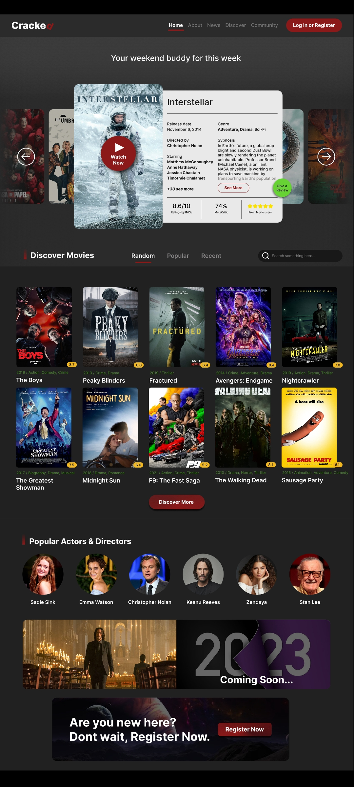
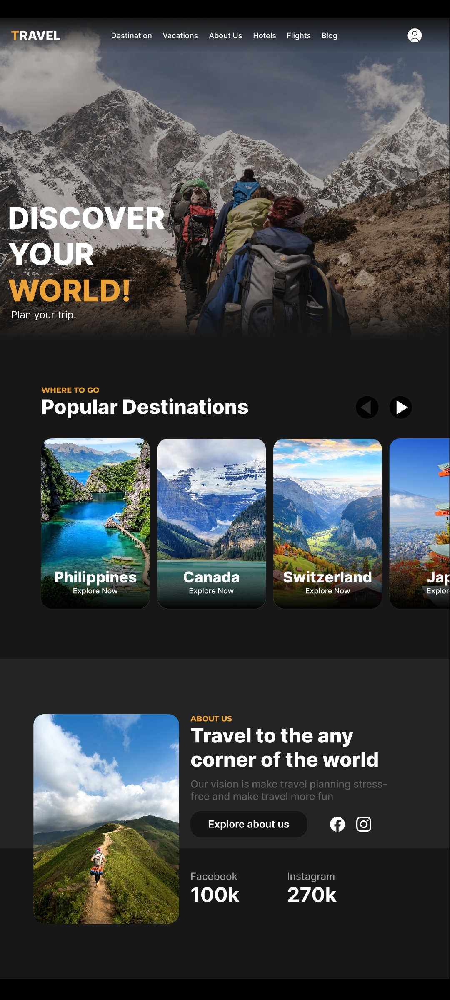
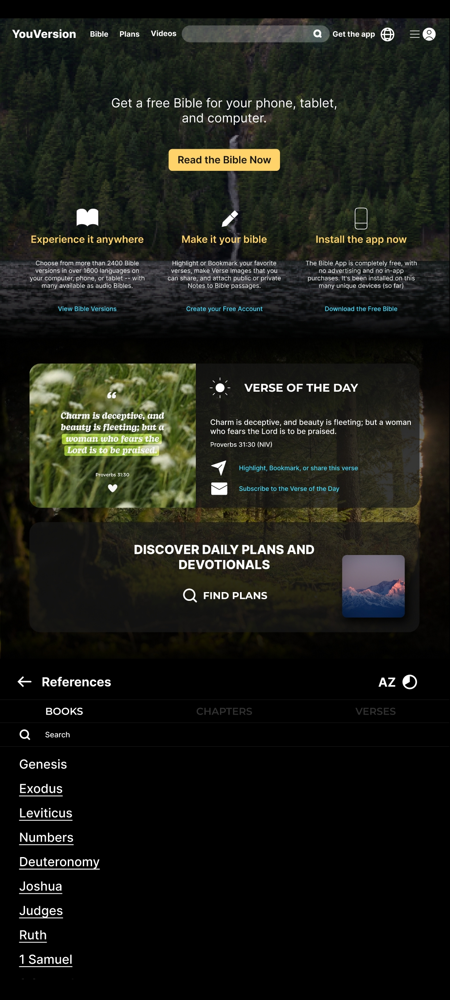
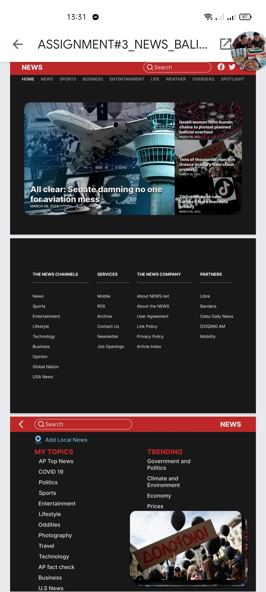
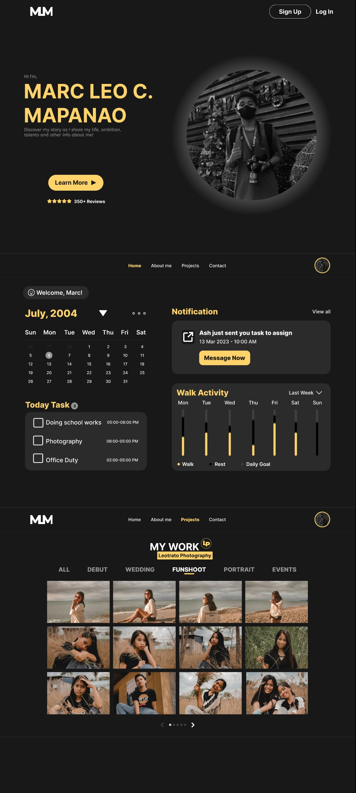

# 🌐 Web Design Projects

Welcome to my collection of **UI/UX web design projects** created using **Figma**.  
These landing pages highlight my design skills in layout, typography, color harmony, and user experience.

---

## 📂 Projects

### 🎬 Cracked – Movie Streaming Website  
A sleek landing page inspired by modern streaming platforms.  

---

### ✈️ Travel – Travel & Adventure Website  
A clean and inviting design showcasing destinations and trip ideas.  

---

### 📖 YouVersion – Bible Reading Platform  
A minimal and serene layout for scripture reading and study.  

---

### 📰 News – News & Media Website  
A structured, professional layout designed for readability and content flow.  

---

### 💼 MyPortfolio – Personal Portfolio Website  
A professional showcase of skills, projects, and contact information.  

---

## 🛠️ Tools Used
- **Figma** – Main design tool

---

## 📩 Contact
If you’d like to collaborate or have a project in mind, feel free to reach out:  

- Email: *mleomapanao@gmail.com*  
- LinkedIn: [My LinkedIn](https://www.linkedin.com/in/mapanao-marc-leo-c-90a74b379/)

---
✨ Designed with passion for creativity and user experience.
